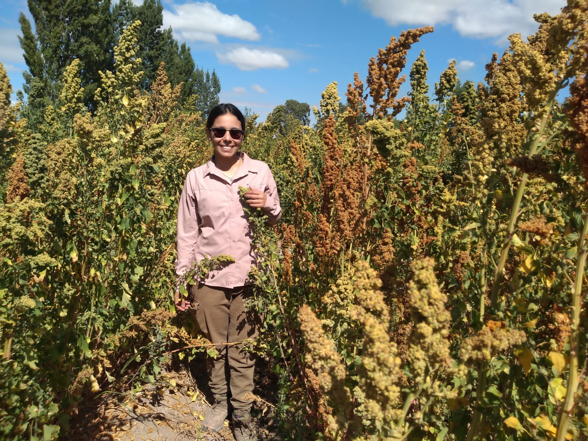

```{r setup, include=FALSE}
knitr::opts_chunk$set(echo = TRUE)
```
<style>
h1 { text-align: center; }
body { font-family: "Arial", sans-serif;}
h1, h2 { font-family: "Times New Roman", serif; }
h2 {color: green;}
</style>

## About me 

* I am from a small town called San Juan, located on the central west of Argentina

* I always thought that I was going to study medicine but at the last minute I changed because I love nature and I wanted to work outdoors

* My goal as a researcher is to make science accessible and practical to farmers.

* I have worked for 9 years with alternative crops such as Quinoa and Amaranth

<div style="text-align: center;">



<div/>