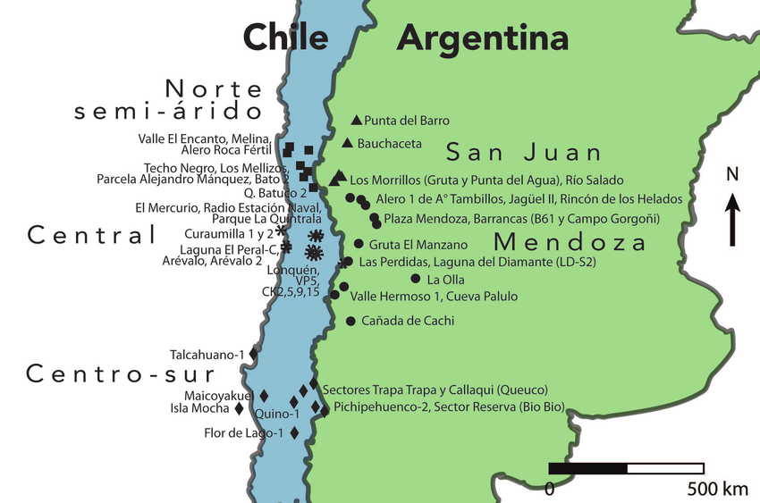

```{r setup, include=FALSE}
knitr::opts_chunk$set(echo = TRUE)
```

<style>
h1, h2, h3 { text-align: center; }
body { 
font-family: "Arial", sans-serif; color: black; 
background-image: url("fondo1.JPG");
    background-size: cover; /* Ajusta la imagen al tamaño de la pantalla */
    background-attachment: fixed; /* La imagen no se desplaza al hacer scroll */
    background-position: center; /* Centra la imagen */
}
h1, h2, h3 { 
font-family: "Times New Roman", serif; 
}
h2, h3 {
color: green;
}
.background-overlay {
    background-color: rgba(150, 200, 255, 0.8); /* Fondo blanco con      80% de transparencia */
    position: absolute;
    top: 0;
    left: 0;
    width: 100%;
    height: 100%;
    z-index: -1; /* Asegura que el contenido quede por encima de la capa */
  }
.centered-image {
display: block; margin-left: auto: margin-right: auto;
}
</style>
<div class="background-overlay"></div>

*Started in 2020 due to Covid restrictions over moving around countries and different regions, our goal is to provide to clients of small regions from Chile and Argentina the possibility of mailing their sampling so they do not have to waste time and money dropping them. We are gonna do our best to give results on time. We also provide consultant services.* 



## WHO ARE WE


### Ana Roldan


#### Contact 

*Mail*: alr325@cornell.edu

*Github account*:https://github.com/alr325


### Andrea Sanchez 


#### Contact

*Mail*: acs332@cornell.edu 

*Git hub account*: https://github.com/Andrea-Sanchez332

