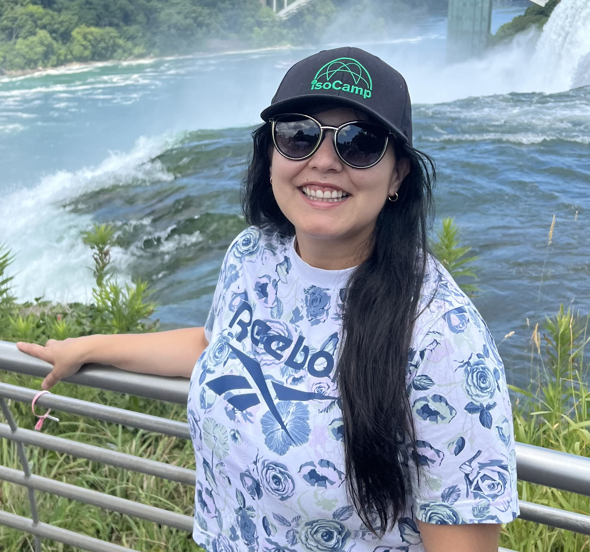

```{r setup, include=FALSE}
knitr::opts_chunk$set(echo = TRUE)
```
<style>
h1 { text-align: center; }
h2 { text-align: center; }
body { font-family: "Arial", sans-serif; }
h1, h2, h3 { font-family: "Times New Roman", serif; }
h2, h3 {color: green;}
</style>
    
*Started in 2020 due to Covid restrictions over moving around countries and different regions, our goal is to provide to clients of small regions from Chile and Argentina the possibility of mailing their sampling so they do not have to waste time and money dropping them. We are gonna do our best to give results on time. We also provide consultant services.* 


## WHO ARE WE


### Ana Roldan

<div style="text-align: center;">


#### Contact 

*Mail*: alr325@cornell.edu

*Github account*:https://github.com/alr325

</div>

### Andrea Sanchez 

<div style="text-align: center;">



#### Contact

*Mail*: acs332@cornell.edu 

*Git hub account*: https://github.com/Andrea-Sanchez332

</div>